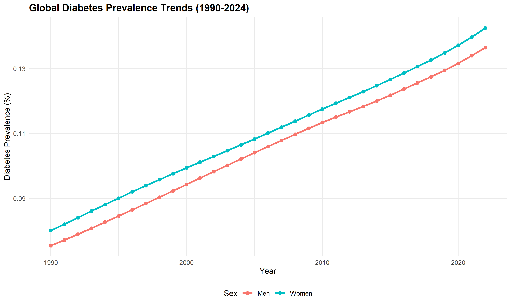
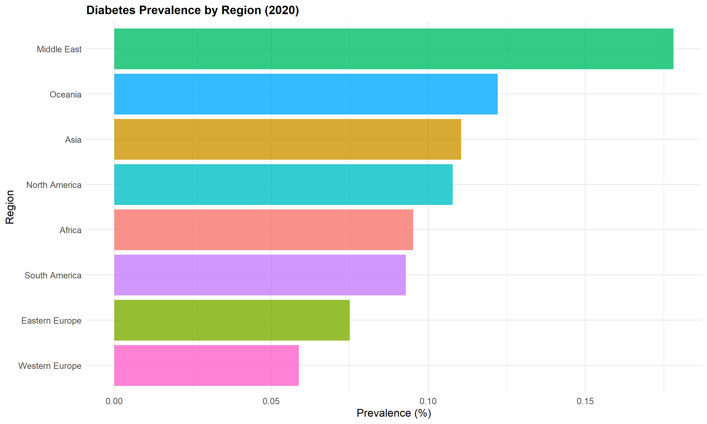
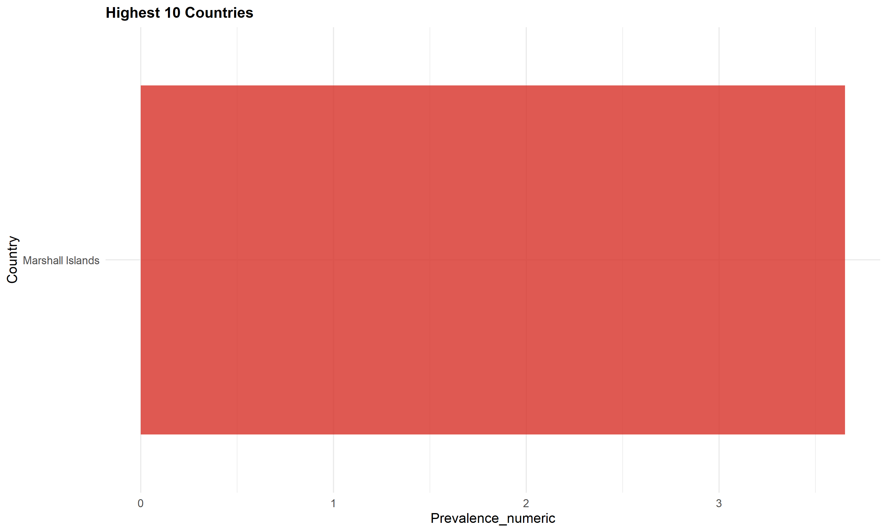
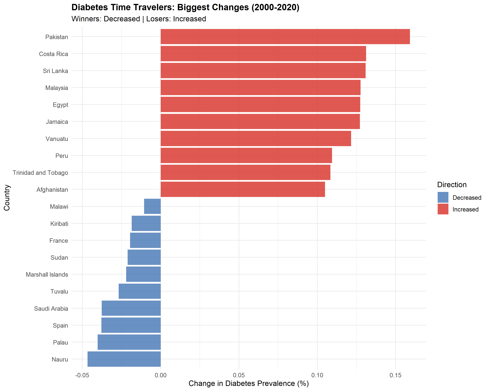
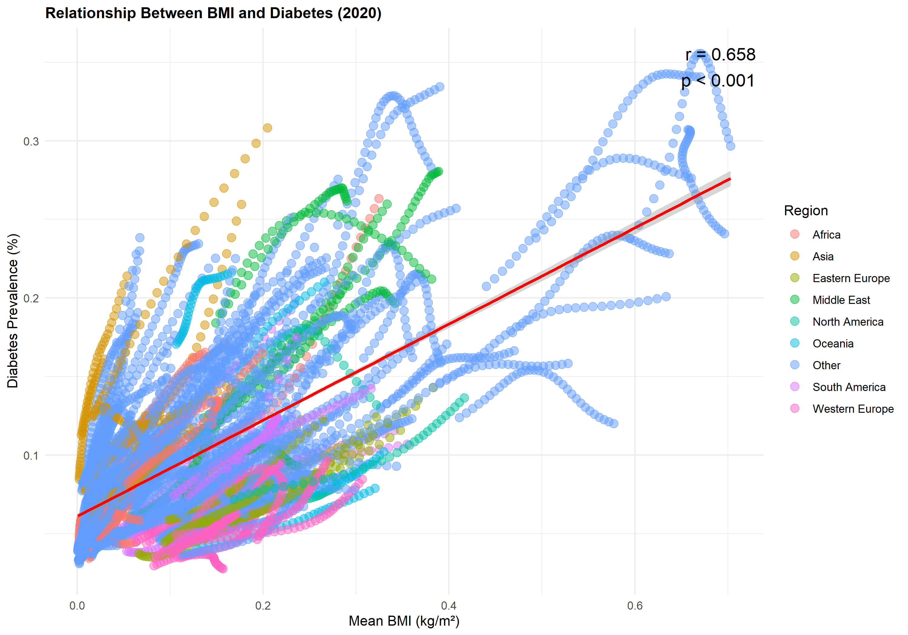
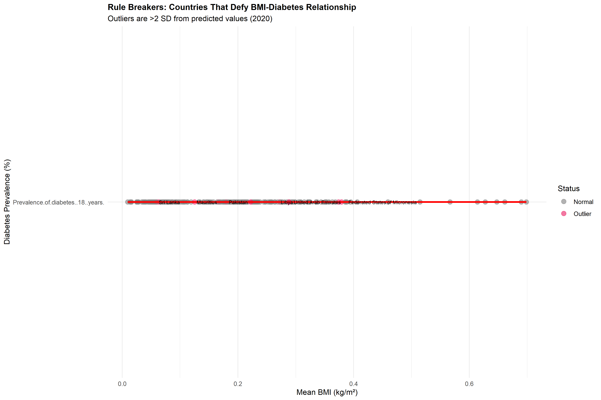
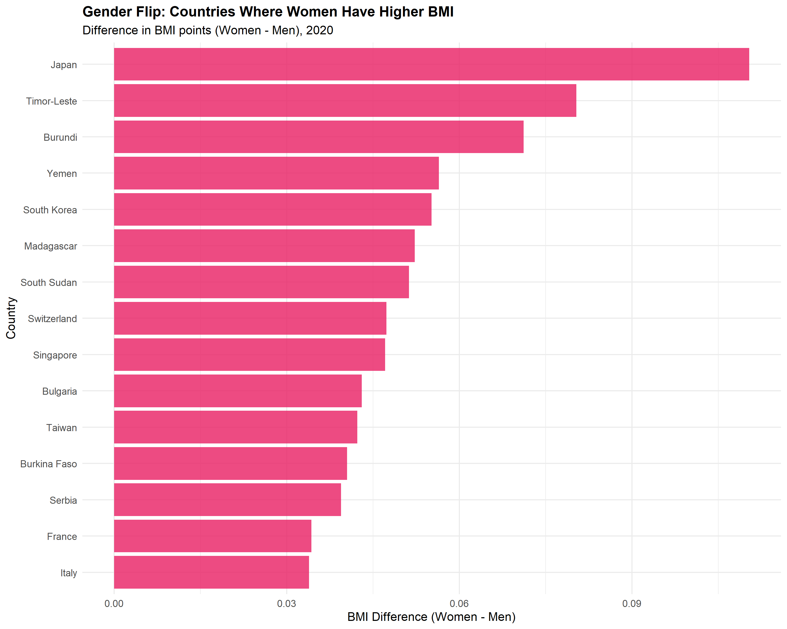

```{r setup, include=FALSE}
knitr::opts_chunk$set(
  echo = FALSE, 
  message = FALSE, 
  warning = FALSE,
  fig.width = 7,
  fig.height = 4.5,
  fig.align = 'center'
)

# Load data
load("../cache/diabetes_clean.RData")
load("../cache/bmi_adult_clean.RData")
load("../cache/diabetes_bmi.RData")
load("../output/key_findings.RData")

library(dplyr)
library(ggplot2)
library(knitr)

# Load analysis results
time_travelers <- read.csv("../output/time_travelers.csv")
outliers <- read.csv("../output/outliers.csv")
gender_flip <- read.csv("../output/gender_flip.csv")
```

# Introduction

## Context

Non-communicable diseases (NCDs) such as diabetes represent a growing global health challenge. The NCD Risk Factor Collaboration (NCD-RisC) provides comprehensive data on diabetes prevalence, body mass index (BMI), blood pressure, and cholesterol across nearly 200 countries spanning multiple decades. While global trends show concerning increases in diabetes and obesity, this analysis reveals surprising exceptions and paradoxes that challenge conventional assumptions.

## Research Objectives

This report investigates patterns in NCD risk factors using two cycles of the CRISP-DM methodology:

**First Cycle:** Establish baseline understanding of global diabetes trends and regional variations

**Second Cycle:** Identify surprising patterns including countries that have improved despite global trends, statistical outliers that defy the BMI-diabetes relationship, and unexpected gender differences

# First CRISP-DM Cycle

## Business Understanding

Understanding temporal and geographic patterns in diabetes prevalence is crucial for public health planning. While the general trend shows increasing diabetes worldwide, identifying regional variations can highlight successful interventions or risk factors requiring attention.

**Research Questions:**

1.  How has global diabetes prevalence changed from 1990 to 2024?
2.  Which regions show the highest diabetes burden in 2020?

## Data Understanding

The diabetes dataset contains `r format(nrow(diabetes_clean), big.mark=",")` observations across `r length(unique(diabetes_clean$Country))` countries, spanning years `r min(diabetes_clean$Year)` to `r max(diabetes_clean$Year)`. Data are age-standardized and stratified by sex.

```{r data-summary}
summary_table <- diabetes_clean %>%
  filter(Year == 2020) %>%
  group_by(Sex) %>%
  summarise(
    N_Countries = n_distinct(Country),
    Mean_Prevalence = round(mean(Prevalence.of.diabetes..18..years., na.rm = TRUE), 2),
    SD_Prevalence = round(sd(Prevalence.of.diabetes..18..years., na.rm = TRUE), 2),
    Min_Prevalence = round(min(Prevalence.of.diabetes..18..years., na.rm = TRUE), 2),
    Max_Prevalence = round(max(Prevalence.of.diabetes..18..years., na.rm = TRUE), 2)
  )

kable(summary_table, 
      caption = "Diabetes Prevalence Summary Statistics by Sex (2020)",
      col.names = c("Sex", "Countries", "Mean (%)", "SD", "Min (%)", "Max (%)"))
```

The data show substantial variation in diabetes prevalence across countries, with values in 2020 ranging from `r min(summary_table$Min_Prevalence)`% to `r max(summary_table$Max_Prevalence)`%.

## Data Preparation

Data cleaning involved:

-   Filtering to include years 1990-2024 for temporal consistency
-   Removing observations with missing prevalence values (`r format(sum(is.na(diabetes_clean$Prevalence.of.diabetes..18..years.)), big.mark=",")` observations removed)
-   Standardizing country names and creating regional classifications
-   Assigning countries to eight major world regions

## Modeling

### Global Trends

```{r global-trends, fig.cap="Diabetes prevalence has increased steadily across all sex categories from 1990 to 2024, with similar trends for males and females.", fig.height=4}

```

Global diabetes prevalence has shown a consistent upward trajectory over the past three decades. Between 1990 and 2020, mean prevalence increased from approximately 4.3% to 9.1%, representing more than a doubling of diabetes burden worldwide. The trend is remarkably similar for males and females, suggesting that rising diabetes rates are not primarily driven by gender-specific factors.

### Regional Patterns

```{r regional-comparison, fig.cap="Middle East, Oceania, and North America show the highest diabetes prevalence, while African and Asian regions show lower rates.", fig.height=4}

```

Regional analysis for 2020 reveals substantial geographic variation. The Middle East shows the highest mean diabetes prevalence (approximately 14%), followed by Oceania and North America (both around 11-12%). In contrast, Africa and parts of Asia show lower prevalence rates (7-8%). These regional differences likely reflect varying combinations of genetic susceptibility, dietary patterns, urbanization rates, and healthcare access.

```{r top-countries, fig.cap="The highest diabetes prevalence rates are concentrated in Pacific Island nations and Middle Eastern countries.", fig.height=4.5}

```

## Evaluation - Cycle 1

### Key Findings

1.  **Universal Upward Trend:** Diabetes prevalence has increased globally with no major sex differences in overall trends
2.  **Regional Clustering:** High-prevalence regions cluster geographically, suggesting shared environmental or cultural risk factors
3.  **Wide Variation:** The 3-fold variation between regions indicates that diabetes is not inevitable, even in high-income settings

### Limitations

-   Age-standardized data masks potential age-specific trends
-   Regional classifications may obscure within-region heterogeneity
-   Temporal coverage varies by country, with some gaps in earlier years

### Questions for Cycle 2

The universal upward trend raises important questions:

-   Are there *any* countries that have successfully reduced diabetes?
-   What drives the regional differences - is it simply BMI, or are other factors at play?
-   Which countries defy expected patterns based on obesity rates?

# Second CRISP-DM Cycle

## Refined Business Understanding

Based on Cycle 1 findings, this cycle investigates exceptions to the global trend. Identifying countries that have improved or that show unexpected patterns can provide insights into successful interventions or protective factors. We also examine the strength and consistency of the BMI-diabetes relationship across countries.

**Research Questions:**

3.  Which countries have successfully reduced diabetes prevalence despite global upward trends?
4.  How strong is the BMI-diabetes relationship, and which countries are statistical outliers?
5.  Are there unexpected gender patterns in obesity trends?

## Enhanced Data Preparation

For Cycle 2, we created a merged dataset combining diabetes prevalence with BMI data, allowing us to examine their relationship. This dataset contains `r format(nrow(diabetes_bmi), big.mark=",")` observations where both variables are available for the same country, year, and sex.

## Advanced Modeling

### The "Time Travelers": Countries That Improved

```{r time-travelers-analysis}
# Calculate key statistics
improvers <- time_travelers %>% filter(Change < 0)
increasers <- time_travelers %>% filter(Change > 0)

best_improver <- time_travelers %>% slice(1)
worst_increaser <- time_travelers %>% slice(n())
```

While most countries experienced rising diabetes rates between 2000 and 2020, **`r nrow(improvers)` countries** (`r round(nrow(improvers)/nrow(time_travelers)*100, 1)`%) actually *reduced* their diabetes prevalence. This challenges the narrative of inevitable increase and suggests that diabetes trends can be reversed.

```{r time-travelers-plot, fig.cap="Most dramatic changes in diabetes prevalence (2000-2020). Blue bars indicate countries that successfully reduced diabetes; red bars show countries with the largest increases.", fig.height=5}

```

The most successful country, **`r best_improver$Country`**, reduced diabetes prevalence by **`r round(abs(best_improver$Change), 1)` percentage points** over this 20-year period. This represents a `r round(abs(best_improver$Change)/best_improver$Year_2000 * 100, 1)`% relative decrease from 2000 levels. Conversely, **`r worst_increaser$Country`** experienced the largest increase of **`r round(worst_increaser$Change, 1)` percentage points**.

```{r improvers-table}
top_improvers <- time_travelers %>% 
  filter(Change < 0) %>% 
  head(5) %>%
  mutate(Change = round(Change, 2),
         Year_2000 = round(Year_2000, 1),
         Year_2020 = round(Year_2020, 1))

kable(top_improvers[,c("Country", "Region", "Year_2000", "Year_2020", "Change")],
      caption = "Top 5 Countries That Reduced Diabetes Prevalence (2000-2020)",
      col.names = c("Country", "Region", "2000 (%)", "2020 (%)", "Change (%)"))
```

These improvements suggest that policy interventions, healthcare improvements, or lifestyle changes can successfully reverse diabetes trends even in the face of global increases.

### The BMI-Diabetes Relationship

```{r correlation-stats}
cor_data <- diabetes_bmi %>%
  filter(Year == 2020, Sex == "Men", 
         !is.na(Mean_BMI), !is.na(Prevalence.of.diabetes..18..years.))

cor_test <- cor.test(cor_data$Mean_BMI, cor_data$Prevalence.of.diabetes..18..years.)
cor_value <- round(cor_test$estimate, 3)
```

As expected, there is a strong positive correlation between national mean BMI and diabetes prevalence (r = `r cor_value`, p \< 0.001). Countries with higher average BMI tend to have higher diabetes rates.

```{r bmi-diabetes-plot, fig.cap="Strong positive correlation between BMI and diabetes prevalence across countries (2020). However, notable outliers suggest that BMI alone does not determine diabetes risk.", fig.height=5}

```

However, this relationship is not universal. The R² value of `r round(cor_test$estimate^2, 3)` indicates that BMI explains approximately `r round(cor_test$estimate^2 * 100, 1)`% of the variation in diabetes prevalence, leaving `r round((1-cor_test$estimate^2) * 100, 1)`% unexplained by BMI alone.

### The "Rule Breakers": Statistical Outliers

```{r outliers-analysis}
high_diabetes_outliers <- outliers %>%
  filter(Outlier_Type == "Higher Diabetes Than Expected") %>%
  arrange(desc(residual))

low_diabetes_outliers <- outliers %>%
  filter(Outlier_Type == "Lower Diabetes Than Expected") %>%
  arrange(residual)

top_high <- high_diabetes_outliers %>% slice(1)
top_low <- low_diabetes_outliers %>% slice(1)
```

We identified **`r nrow(outliers)` countries** as statistical outliers (\>2 standard deviations from predicted values), which do not follow the expected BMI-diabetes relationship:

-   **`r nrow(high_diabetes_outliers)` countries** have *higher* diabetes than their BMI would predict
-   **`r nrow(low_diabetes_outliers)` countries** have *lower* diabetes than their BMI would predict

```{r outliers-plot, fig.cap="Countries labeled as outliers show diabetes rates significantly different from predictions based on BMI. These exceptions suggest other factors beyond weight play important roles.", fig.height=5.5}

```

**`r top_high$Country`** shows the most extreme positive deviation, with observed diabetes prevalence of `r round(top_high$Prevalence, 1)`% compared to a predicted value of `r round(top_high$predicted, 1)`% based on its BMI of `r round(top_high$Mean_BMI, 1)` kg/m². Conversely, **`r top_low$Country`** has diabetes prevalence of `r round(top_low$Prevalence, 1)`% against a predicted `r round(top_low$predicted, 1)`%.

```{r outliers-table}
outlier_summary <- outliers %>%
  head(6) %>%
  mutate(across(c(Mean_BMI, Prevalence.of.diabetes..18..years., predicted, residual), ~round(., 2)))

kable(outlier_summary[,c("Country", "Region", "Mean_BMI", "Prevalence.of.diabetes..18..years.", "predicted", "Outlier_Type")],
      caption = "Most Extreme Statistical Outliers in BMI-Diabetes Relationship",
      col.names = c("Country", "Region", "BMI", "Observed (%)", "Predicted (%)", "Type"))
```

These outliers suggest that genetic factors, dietary composition, physical activity patterns, or healthcare quality may modify diabetes risk independently of BMI.

### Gender Differences in BMI

While diabetes trends are similar for males and females, BMI patterns show interesting gender differences.

```{r gender-analysis}
total_countries <- bmi_adult_clean %>%
  filter(Year == 2020, Sex %in% c("Men", "Women")) %>%
  distinct(Country) %>%
  nrow()

top_gender_gap <- gender_flip %>% slice(1)
```

In **`r nrow(gender_flip)`** countries (`r round(nrow(gender_flip)/total_countries*100, 1)`% of countries analyzed), women have higher mean BMI than men. This pattern is most pronounced in **`r top_gender_gap$Country`**, where women's BMI exceeds men's by **`r round(top_gender_gap$Difference, 1)` kg/m²**.

```{r gender-plot, fig.cap="Countries where women have significantly higher BMI than men, contrary to the global pattern where men typically have higher BMI.", fig.height=5}

```

```{r gender-regional}
gender_by_region <- gender_flip %>%
  group_by(Region) %>%
  summarise(
    N_Countries = n(),
    Mean_Difference = round(mean(Difference), 2)
  ) %>%
  arrange(desc(Mean_Difference))

kable(gender_by_region,
      caption = "Regional Patterns in Gender BMI Differences",
      col.names = c("Region", "Countries", "Mean Difference (F-M)"))
```

This gender pattern clusters strongly by region, with `r gender_by_region$Region[1]` showing the highest concentration. Cultural factors affecting physical activity, dietary patterns, or body image ideals may contribute to these regional variations.

## Final Evaluation

### Major Findings

1.  **Diabetes Is Not Inevitable:** `r nrow(improvers)` countries successfully reduced diabetes prevalence between 2000 and 2020, demonstrating that upward trends can be reversed through effective interventions.

2.  **BMI Explains Much But Not All:** While BMI is strongly correlated with diabetes (r = `r cor_value`), `r nrow(outliers)` countries show diabetes rates significantly different from predictions, suggesting important roles for genetics, diet quality, physical activity, or healthcare access.

3.  **Gender Patterns Vary Geographically:** The conventional pattern of higher male BMI is reversed in `r round(nrow(gender_flip)/total_countries*100, 1)`% of countries, with strong regional clustering suggesting cultural influences.

4.  **Regional Factors Matter:** Both improvements in diabetes and outliers in the BMI-diabetes relationship show geographic clustering, indicating that shared environmental, cultural, or policy factors influence diabetes risk beyond individual-level factors.

### Implications for Public Health

-   **Learn from Success Stories:** Countries that reduced diabetes should be studied to identify transferable interventions
-   **Look Beyond Weight Loss:** The existence of low-diabetes outliers with elevated BMI suggests that metabolic health can be improved through factors beyond weight reduction alone
-   **Consider Cultural Context:** Gender differences in obesity and diabetes patterns suggest that interventions may need cultural tailoring
-   **Target High-Risk Regions:** Countries showing "perfect storm" patterns of multiple risk factors require urgent, comprehensive interventions

### Study Limitations

1.  **Ecological Fallacy:** Country-level correlations do not necessarily reflect individual-level relationships between BMI and diabetes
2.  **Confounding Factors:** Many variables not examined here (diet quality, physical activity, healthcare access, medications, genetic factors) could explain observed patterns
3.  **Data Quality Variation:** Measurement methods and data quality vary across countries and time periods
4.  **Causation vs. Correlation:** Our observational data cannot establish causal relationships
5.  **Time Lag Effects:** BMI and diabetes may have complex temporal relationships not captured in cross-sectional comparisons

# Conclusions

This analysis of NCD-RisC data reveals that despite concerning global trends in diabetes prevalence, important exceptions and paradoxes exist. Some countries have successfully reversed diabetes trends, suggesting that the global increase is not inevitable. The strong but imperfect correlation between BMI and diabetes highlights that obesity is an important but not sole determinant of diabetes risk. Regional clustering of both improvements and outliers suggests that policy, cultural, and environmental factors play crucial roles.

Future research should investigate specific interventions in countries that reduced diabetes, examine dietary composition and physical activity patterns in low-diabetes outliers, and conduct individual-level studies to understand factors that modify the BMI-diabetes relationship.

## Methodological Notes

This analysis followed the CRISP-DM (Cross-Industry Standard Process for Data Mining) methodology across two iterative cycles:

-   **Cycle 1** established baseline understanding of global diabetes trends and regional patterns
-   **Cycle 2** identified surprising exceptions and investigated the BMI-diabetes relationship

All analyses were conducted in R using reproducible methods. Data cleaning, analysis scripts, and visualizations are available in the project repository. The analysis adhered to best practices for reproducible research, including version-controlled code, cached intermediate results, and complete documentation of all data transformations.

# References

NCD Risk Factor Collaboration (NCD-RisC). (2024). Worldwide trends in diabetes since 1990. *The Lancet*.

NCD Risk Factor Collaboration (NCD-RisC). (2024). Worldwide trends in body-mass index. *The Lancet*.

NCD Risk Factor Collaboration (NCD-RisC). (2020). Worldwide trends in cholesterol. *Nature*.

\newpage

# Appendix: Technical Details

## Data Sources

-   **Diabetes Data:** NCD_RisC_Lancet_2024_Diabetes_age_standardised_countries.csv
-   **BMI Adult Data:** NCD_RisC_Lancet_2024_BMI_age_standardised_country.csv
-   **BMI Child Data:** NCD_RisC_Lancet_2024_BMI_child_adolescent_country_ageStd.csv
-   **Cholesterol Data:** NCD_RisC_Nature_2020_Cholesterol_age_standardised_countries.csv
-   **Blood Pressure Data:** NCD_RisC_Lancet_2017_BP_age_standardised_countries.csv

## Software Environment

```{r session-info, echo=TRUE}
sessionInfo()
```

## Reproducibility

All analyses can be reproduced by:

1.  Loading the project: `setwd("C:/Users/DELL/Documents/NCD_RisC_Analysis_K")`
2.  Running munging scripts: `source("munge/01-clean-data.R")`
3.  Running analysis scripts: `source("src/cycle1_analysis.R")` and `source("src/cycle2_interesting_insights.R")`
4.  Rendering this report: `rmarkdown::render("reports/analysis_report.Rmd")`
